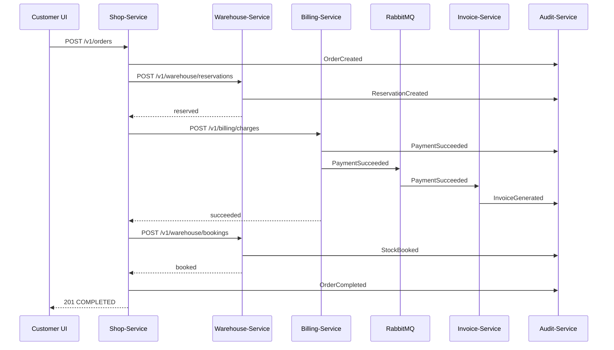
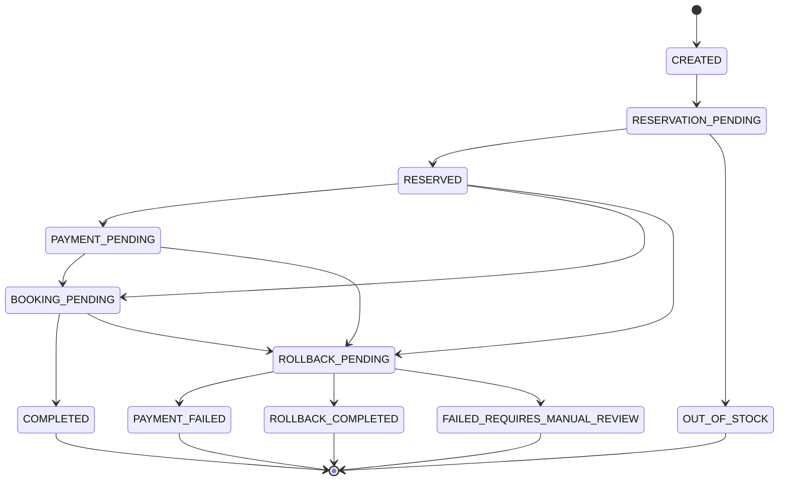

# Saga, Transaktionen und Konsistenz

## Warum eine Saga notwendig ist

Die Bestellung berührt mehrere Services mit eigener Datenhaltung. Eine klassische ACID-Transaktion über Shop-, Warehouse- und Billing-Datenbank wäre technisch falsch und architektonisch nicht gewollt. Stattdessen wird jeder Service lokal konsistent gehalten. Die Gesamtkonsistenz entsteht durch eine orchestrierte Saga mit klar definierten Kompensationsschritten.

## Orchestrierungsprinzip

Der Shop-Service ist der Saga-Orchestrator. Er kennt die Reihenfolge der Schritte und entscheidet bei Fehlern, welche Kompensation ausgelöst wird.

Vorteile dieser Entscheidung:

- Der Bestellprozess bleibt zentral nachvollziehbar.
- Statuswechsel können im Shop-Service konsistent modelliert werden.
- Fehlerpfade sind für Demo und Tests explizit auslösbar.
- Frontends müssen nicht selbst mehrere Services koordinieren.

## Happy Path

## Happy-Path-Schritte im Detail

| Schritt | Owner | Lokale Transaktion | Ergebnis |
| --- | --- | --- | --- |
| Request validieren | Shop | Nein | Fehlerhafte Requests werden abgelehnt. |
| Idempotenz-Key sperren | Shop/Redis | Redis-Operation | Nur ein Prozess verarbeitet den Key. |
| Order anlegen | Shop | Ja | Status `CREATED`. |
| Bestand reservieren | Warehouse | Ja | Bestand wird atomar von frei nach reserviert bewegt. |
| Zahlung starten | Billing | Ja | Payment wird gespeichert und Provider aufgerufen. |
| Rechnung anstoßen | Billing/RabbitMQ | Ja/Event | `PaymentSucceeded` wird publiziert. |
| Bestand ausbuchen | Warehouse | Ja | Reservierung wird final gebucht. |
| Order abschließen | Shop | Ja | Status `COMPLETED`, Warenkorb wird geleert. |
| Idempotenzantwort speichern | Shop/Redis | Redis-Operation | Wiederholung erhält dieselbe Antwort. |

## Fehlerpfad A: Zahlung abgelehnt

Auslöser: Billing-Service oder Payment-Provider liefert `FAILED`.

Kompensation:

1. Shop-Service setzt Order auf `ROLLBACK_PENDING` oder direkt in einen Payment-Fehlerpfad.
2. Shop-Service ruft `DELETE /v1/warehouse/reservations/{correlationId}` auf.
3. Warehouse gibt reservierte Mengen frei.
4. Warehouse publiziert `ReservationCancelled`.
5. Shop-Service setzt Order auf `PAYMENT_FAILED`.
6. Idempotenzantwort wird gespeichert.

Ergebnis:

- Keine Zahlung ist offen.
- Kein Bestand bleibt reserviert.
- Die Bestellung bleibt auditierbar als fehlgeschlagen erhalten.

## Fehlerpfad B: Lager nicht ausreichend

Auslöser: Warehouse-Service lehnt die Reservierung ab.

Kompensation:

- Keine Kompensation nötig, da noch kein nachfolgender Schritt ausgeführt wurde.

Ergebnis:

- Order erhält Status `OUT_OF_STOCK`.
- Billing wird nicht aufgerufen.
- Audit enthält `ReservationRejected` und `OrderFailedOutOfStock`.

## Fehlerpfad C: Finale Warehouse-Ausbuchung schlägt fehl

Auslöser: Zahlung war erfolgreich, aber `POST /v1/warehouse/bookings` schlägt fehl.

Kompensation:

1. Shop-Service setzt Order auf `ROLLBACK_PENDING`.
2. Shop-Service ruft `POST /v1/billing/refunds` auf.
3. Billing-Service führt Refund über Payment-Fassade aus.
4. Billing publiziert `PaymentRefunded`.
5. Shop-Service setzt Order auf `ROLLBACK_COMPLETED`.
6. Falls nötig, wird die Reservierung zusätzlich storniert oder als technisch fehlgeschlagen markiert.

Ergebnis:

- Kunde wird nicht belastet.
- Audit zeigt Zahlung, Booking-Fehler und Refund.
- Der Fall ist in der Demo besonders wertvoll, weil er echte Kompensation nach Teilabschluss zeigt.

## Asynchroner Payment-Pfad

Wenn der Payment-Provider `PENDING` liefert, darf der Shop-Service nicht blockierend warten. Die Saga wird pausiert und später fortgesetzt.

Ablauf:

1. Billing legt Payment mit Status `PENDING` an.
2. Shop-Service setzt Order auf `PAYMENT_PENDING`.
3. Client erhält `202 Accepted` oder `201` mit Pending-Status.
4. Payment-Stub sendet Webhook nach konfigurierter Verzögerung.
5. Billing aktualisiert Payment auf `SUCCEEDED` oder `FAILED`.
6. Billing publiziert ein Event.
7. Shop-Service konsumiert oder erhält die Fortsetzung und führt Booking oder Kompensation aus.

## Saga-Zustandsmaschine

## Statusübergänge und erlaubte Trigger

| Von | Nach | Trigger |
| --- | --- | --- |
| `CREATED` | `RESERVATION_PENDING` | Orchestrator startet Warehouse-Aufruf. |
| `RESERVATION_PENDING` | `RESERVED` | Warehouse reserviert erfolgreich. |
| `RESERVATION_PENDING` | `OUT_OF_STOCK` | Warehouse lehnt ab. |
| `RESERVED` | `PAYMENT_PENDING` | Billing liefert Pending. |
| `RESERVED` | `BOOKING_PENDING` | Billing liefert synchronen Erfolg. |
| `RESERVED` | `ROLLBACK_PENDING` | Billing liefert Fehler. |
| `PAYMENT_PENDING` | `BOOKING_PENDING` | Webhook meldet Erfolg. |
| `PAYMENT_PENDING` | `ROLLBACK_PENDING` | Webhook meldet Fehler. |
| `BOOKING_PENDING` | `COMPLETED` | Warehouse bucht final. |
| `BOOKING_PENDING` | `ROLLBACK_PENDING` | Warehouse-Booking scheitert. |
| `ROLLBACK_PENDING` | `PAYMENT_FAILED` | Reservierungsstorno nach Payment-Fehler erledigt. |
| `ROLLBACK_PENDING` | `ROLLBACK_COMPLETED` | Refund erledigt. |
| `ROLLBACK_PENDING` | `FAILED_REQUIRES_MANUAL_REVIEW` | Kompensation scheitert endgültig. |

## Kompensationsmatrix

| Fehlerzeitpunkt | Bereits passiert | Kompensation | Endstatus |
| --- | --- | --- | --- |
| Vor Order-Anlage | Nichts | Keine | Request-Fehler |
| Nach Order-Anlage, vor Reservierung | Order existiert | Status auf Fehler setzen | `FAILED_REQUIRES_MANUAL_REVIEW` oder technischer Fehler |
| Reservierung abgelehnt | Order existiert | Keine | `OUT_OF_STOCK` |
| Zahlung abgelehnt | Reservierung aktiv | Reservierung stornieren | `PAYMENT_FAILED` |
| Payment-Webhook fehlgeschlagen | Reservierung aktiv | Reservierung stornieren | `PAYMENT_FAILED` |
| Booking fehlgeschlagen | Zahlung erfolgreich, Reservierung aktiv | Refund auslösen | `ROLLBACK_COMPLETED` |
| Refund fehlgeschlagen | Zahlung erfolgreich | Manuelle Prüfung | `FAILED_REQUIRES_MANUAL_REVIEW` |
| Invoice fehlgeschlagen | Order abgeschlossen, Zahlung erfolgreich | Kein Rollback, Retry | `COMPLETED` mit Invoice-Warnung |

## Zeitüberschreitungen

Timeouts müssen fachlich eingeordnet werden. Ein Netzwerk-Timeout bedeutet nicht automatisch, dass der Zielservice nichts getan hat.

Empfohlene Regeln:

- Bei Warehouse-Reservierung nach Timeout über `correlationId` nachfragen oder idempotent wiederholen.
- Bei Billing-Charge nach Timeout den Payment-Status prüfen, bevor ein neuer Charge erzeugt wird.
- Bei Refund-Timeout den Refund-Status prüfen.
- Bei Invoice-Timeout nur Retry und Circuit Breaker verwenden, kein Payment-Rollback.

## Idempotenz in der Saga

Alle kritischen Kommandos müssen idempotent sein:

| Kommando | Idempotenzbasis |
| --- | --- |
| `POST /v1/orders` | `userId + X-Idempotency-Key`. |
| `POST /v1/warehouse/reservations` | `correlationId`. |
| `DELETE /v1/warehouse/reservations/{correlationId}` | `correlationId`. |
| `POST /v1/warehouse/bookings` | `correlationId`. |
| `POST /v1/billing/charges` | `correlationId`. |
| `POST /v1/billing/refunds` | `correlationId`. |
| Invoice-Event-Verarbeitung | `correlationId` oder `invoiceNumber`. |

## Konsistenzgarantien

Das System garantiert keine sofortige globale Konsistenz. Es garantiert:

- Keine Überverkäufe im Warehouse.
- Keine doppelte Bestellung bei gleichem Idempotenz-Key.
- Keine doppelte Payment-Ausführung je `correlationId`.
- Nachvollziehbare Kompensationsentscheidungen.
- Endzustände, die operativ interpretierbar sind.

## Audit-Anforderungen pro Saga

Jede Saga muss eine lückenlose Audit-Kette erzeugen:

- Start der Order.
- Start und Ergebnis der Reservierung.
- Start und Ergebnis der Zahlung.
- Pending-Zustände bei asynchronem Payment.
- Start und Ergebnis des Bookings.
- Start und Ergebnis jeder Kompensation.
- Technische Fehler mit Service, Code und Kontext.

## Testbare Invarianten

- Eine `COMPLETED`-Order hat eine erfolgreiche Zahlung und eine gebuchte Reservierung.
- Eine `PAYMENT_FAILED`-Order hat keine aktive Reservierung.
- Eine `OUT_OF_STOCK`-Order hat keinen Payment-Datensatz.
- Eine `ROLLBACK_COMPLETED`-Order hat einen erfolgreichen Refund.
- Eine Order mit `PAYMENT_PENDING` darf nicht final ausgebucht sein.
- Jeder Endstatus besitzt mindestens einen Audit-Snapshot.